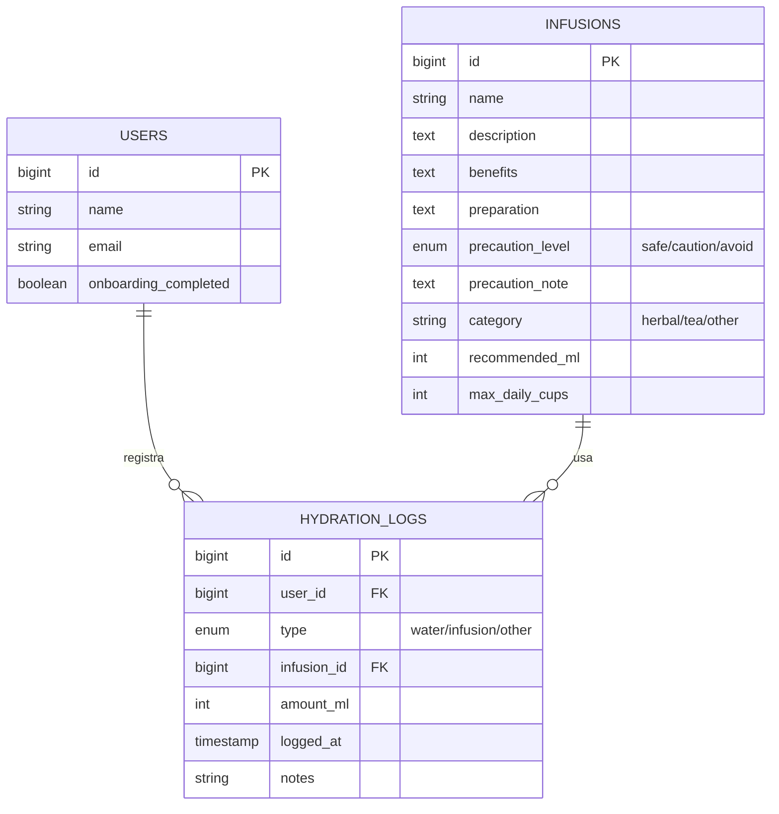

# Actualizaciones de la API – App de Nutrición para Hipertensión

> **Proyecto:** hipertension-api (Laravel 10 + JWT)  
> **Fecha:** 7 de febrero de 2026  
> **Total de rutas:** 58 endpoints  
> **Base de datos:** MySQL (cPanel)

---

## Índice

1. [Resumen ejecutivo](#1-resumen-ejecutivo)
2. [Módulo: Onboarding (RF-01)](#2-módulo-onboarding-rf-01)
3. [Módulo: Presión arterial – Semáforo y estadísticas (RF-02/RF-03)](#3-módulo-presión-arterial--semáforo-y-estadísticas-rf-02rf-03)
4. [Módulo: Recomendaciones nutricionales DASH (RF-05)](#4-módulo-recomendaciones-nutricionales-dash-rf-05)
5. [Módulo: Rachas de hábitos (RF-08)](#5-módulo-rachas-de-hábitos-rf-08)
6. [Módulo: Adherencia a medicamentos (RF-09.3/RF-09.4)](#6-módulo-adherencia-a-medicamentos-rf-093rf-094)
7. [Módulo: Dashboard consolidado (RF-10)](#7-módulo-dashboard-consolidado-rf-10)
8. [Módulo: Hidratación e infusiones](#8-módulo-hidratación-e-infusiones)
9. [Migraciones nuevas](#9-migraciones-nuevas)
10. [Modelos actualizados](#10-modelos-actualizados)
11. [Seeders](#11-seeders)
12. [Listado completo de endpoints](#12-listado-completo-de-endpoints)
13. [Diagrama de arquitectura](#13-diagrama-de-arquitectura)

---

## 1. Resumen ejecutivo

Se implementaron las especificaciones del documento SRS (Especificación de Requisitos de Software) sobre la API existente, agregando los siguientes módulos funcionales:

| Actualización | Requisito | Archivos nuevos |
|---|---|---|
| Onboarding con PA inicial | RF-01 | 1 migración |
| Semáforo de PA + estadísticas | RF-02 / RF-03 | – (controlador ampliado) |
| Recomendaciones nutricionales DASH | RF-05 | 1 controlador |
| Rachas de hábitos + refuerzo positivo | RF-08 | 1 controlador |
| Adherencia a medicamentos | RF-09.3 / RF-09.4 | 1 controlador |
| Dashboard consolidado + historial | RF-10 | 1 controlador |
| Contenido educativo progresivo | RF-07 | 1 migración |
| Hidratación e infusiones | Nuevo | 2 migraciones, 2 modelos, 2 controladores, 1 seeder |
| Disclaimer público | RNF-05 | – (ruta closure) |

**Progresión de rutas:** 42 → 51 → **58 endpoints**

---

## 2. Módulo: Onboarding (RF-01)

**Objetivo:** Capturar datos clínicos iniciales del usuario al primer uso de la app.

### Endpoint

| Método | URI | Controlador |
|---|---|---|
| `POST` | `/api/onboarding` | `AuthController@onboarding` |

### Campos recibidos

| Campo | Tipo | Descripción |
|---|---|---|
| `age` | integer | Edad del usuario |
| `gender` | string | masculino / femenino / otro |
| `weight` | decimal | Peso en kg |
| `height` | decimal | Altura en metros |
| `activity_level` | string | sedentario / leve / moderado / activo / muy_activo |
| `hta_level` | string | leve / moderada / severa |
| `initial_systolic` | integer | PA sistólica inicial |
| `initial_diastolic` | integer | PA diastólica inicial |
| `food_restrictions` | text | Restricciones alimentarias |

### Comportamiento
- Actualiza el perfil del usuario
- Establece `onboarding_completed = true`
- Crea automáticamente el primer registro de presión arterial
- El endpoint `POST /api/login` ahora retorna `onboarding_completed` para que Flutter sepa si redirigir al onboarding

### Migración

```
2025_01_01_000011_add_onboarding_fields_to_users_table.php
```

Campos agregados a `users`: `initial_systolic`, `initial_diastolic`, `food_restrictions`, `onboarding_completed`.

---

## 3. Módulo: Presión arterial – Semáforo y estadísticas (RF-02/RF-03)

**Objetivo:** Clasificar cada medición de PA con un semáforo visual y proveer estadísticas agrupadas.

### Semáforo de clasificación (RF-03)

| Color | Nivel | Sistólica | Diastólica | Mensaje |
|---|---|---|---|---|
| 🟢 Verde | Controlada | < 120 | < 80 | Presión arterial dentro del rango normal |
| 🟡 Amarillo | Elevada | 120–139 | 80–89 | Presión arterial elevada, mantener vigilancia |
| 🔴 Rojo | Alta | ≥ 140 | ≥ 90 | Presión arterial alta, consulte a su médico |

El método estático `classify(systolic, diastolic)` se reutiliza en:
- `store()` – al crear registro
- `show()` – al consultar registro
- `statistics()` – en cada registro del período
- `NutritionalRecommendationController` – para generar recomendaciones dinámicas
- `DashboardController` – para el resumen

### Estadísticas (RF-02)

| Método | URI | Parámetros |
|---|---|---|
| `GET` | `/api/blood-pressure-stats` | `?period=daily\|weekly\|monthly` |

**Respuesta:**
```json
{
  "period": "weekly",
  "count": 7,
  "avg_systolic": 128.5,
  "avg_diastolic": 82.3,
  "min_systolic": 118,
  "max_systolic": 142,
  "min_diastolic": 76,
  "max_diastolic": 92,
  "latest_classification": { "level": "elevada", "color": "amarillo", "message": "..." },
  "records": [...]
}
```

---

## 4. Módulo: Recomendaciones nutricionales DASH (RF-05)

**Objetivo:** Generar recomendaciones dinámicas basadas en la última medición de PA y el modelo DASH.

### Endpoint

| Método | URI | Controlador |
|---|---|---|
| `GET` | `/api/nutritional-recommendations` | `NutritionalRecommendationController@index` |

### Lógica

1. Obtiene la última medición de PA del usuario
2. Clasifica con el semáforo
3. Según el nivel genera:

| Nivel | Comportamiento |
|---|---|
| **Controlada** | Tips generales DASH, sustituciones básicas |
| **Elevada** | + Limitar sodio a <1500mg/día, más sustituciones, alimentos ricos en potasio |
| **Alta** | + Eliminar procesados y embutidos, restricciones estrictas |

### Respuesta incluye

- `classification` – resultado del semáforo
- `recommendations[]` – lista de consejos personalizados
- `substitutions[]` – pares de sustitución (original → alternativa)
- `suggested_foods[]` – alimentos recomendados de la BD (bajo sodio, alto potasio)
- `avoid_foods[]` – alimentos a evitar (alto sodio)
- `dash_tips[]` – consejos del modelo DASH

---

## 5. Módulo: Rachas de hábitos (RF-08)

**Objetivo:** Calcular rachas de hábitos saludables y generar mensajes de refuerzo positivo.

### Endpoints

| Método | URI | Descripción |
|---|---|---|
| `GET` | `/api/habit-streaks` | Rachas de todos los hábitos |
| `GET` | `/api/habit-streaks/{habit}` | Racha de un hábito específico |

### Cálculo de racha

- **current_streak** – Días consecutivos completados hasta hoy
- **best_streak** – Mejor racha histórica
- **completed_today** – Si se completó hoy
- **total_completions** – Total de veces completado

### Refuerzo positivo

| Racha | Mensaje |
|---|---|
| ≥ 30 días | 🏆 ¡Increíble! Más de un mes... |
| ≥ 14 días | 🌟 ¡Dos semanas seguidas! |
| ≥ 7 días | 💪 ¡Una semana completa! |
| ≥ 3 días | 🔥 ¡Vas por buen camino! |
| ≥ 1 día | 👍 ¡Buen comienzo! |
| 0 | 💡 ¡Hoy es un buen día para comenzar! |

---

## 6. Módulo: Adherencia a medicamentos (RF-09.3/RF-09.4)

**Objetivo:** Estadísticas de cumplimiento de tomas con alertas informativas (no clínicas).

### Endpoint

| Método | URI | Parámetros |
|---|---|---|
| `GET` | `/api/medication-adherence` | `?period=weekly\|monthly` |

### Respuesta

```json
{
  "period": "monthly",
  "medications": [
    {
      "medication": { "id": 1, "name": "Enalapril" },
      "total_logs": 30,
      "taken": 27,
      "omitted": 3,
      "adherence_rate": 90.0,
      "warning": null
    }
  ],
  "global_adherence": 87.5,
  "message": "📊 Buena adherencia, pero hay margen de mejora.",
  "disclaimer": "Este es un seguimiento informativo..."
}
```

### Alertas informativas

| Condición | Tipo | Ejemplo |
|---|---|---|
| ≥ 5 omisiones | Omisiones frecuentes | "Has omitido 8 tomas este mes" |
| Adherencia < 50% | Adherencia baja | "Tu adherencia es del 40%" |
| Adherencia < 80% | Mejorable | "Intenta mantener una adherencia mayor al 80%" |

> **Nota:** La app no emite alertas médicas ni diagnósticos (RNF-05).

---

## 7. Módulo: Dashboard consolidado (RF-10)

**Objetivo:** Vista resumen y historial unificado filtrable.

### Endpoints

| Método | URI | Parámetros | Descripción |
|---|---|---|---|
| `GET` | `/api/dashboard` | – | Vista consolidada del día |
| `GET` | `/api/history` | `?from=&to=` | Historial unificado filtrado |

### Dashboard (`/api/dashboard`)

Retorna en una sola llamada:

| Sección | Contenido |
|---|---|
| `latest_bp` | Último registro de PA con clasificación semáforo |
| `weekly_bp` | Cantidad de registros y promedio semanal |
| `medication_adherence` | % de adherencia semanal |
| `habits_today` | Cantidad de hábitos completados hoy |
| `food_logs_today` | Cantidad de alimentos registrados hoy |
| `active_meal_plan` | Plan alimenticio activo (si existe) |
| `disclaimer` | Aviso legal obligatorio |

### Historial (`/api/history`)

Retorna datos unificados del período solicitado:
- Registros de PA (con clasificación)
- Registros de alimentos (con detalle del alimento)
- Medicamentos con sus logs
- Logs de hábitos (con detalle del hábito)

---

## 8. Módulo: Hidratación e infusiones

**Objetivo:** Catálogo de infusiones clasificadas por seguridad para HTA + seguimiento de ingesta diaria de líquidos.

### Endpoints

| Método | URI | Descripción |
|---|---|---|
| `GET` | `/api/infusions` | Catálogo agrupado por nivel de precaución |
| `GET` | `/api/infusions/{id}` | Detalle de una infusión |
| `POST` | `/api/infusions` | Crear infusión (admin) |
| `GET` | `/api/hydration-logs` | Registros de hidratación (filtro: `?date=&type=`) |
| `POST` | `/api/hydration-logs` | Registrar ingesta de líquido |
| `DELETE` | `/api/hydration-logs/{id}` | Eliminar registro |
| `GET` | `/api/hydration-summary` | Resumen diario de hidratación |

### Tabla `infusions` – Catálogo de infusiones

| Campo | Tipo | Descripción |
|---|---|---|
| `name` | string | Nombre de la infusión |
| `description` | text | Descripción general |
| `benefits` | text | Beneficios para HTA |
| `preparation` | text | Modo de preparación |
| `precaution_level` | enum | `safe` / `caution` / `avoid` |
| `precaution_note` | text | Nota de precaución específica |
| `category` | string | `herbal` / `tea` / `other` |
| `recommended_ml` | integer | ml recomendados por taza |
| `max_daily_cups` | integer | Máximo de tazas diarias |
| `image_url` | string | URL de imagen (nullable) |

### Tabla `hydration_logs` – Registro de hidratación

| Campo | Tipo | Descripción |
|---|---|---|
| `user_id` | FK → users | Propietario |
| `type` | enum | `water` / `infusion` / `other` |
| `infusion_id` | FK → infusions | Nullable, solo para tipo infusion |
| `amount_ml` | integer | Cantidad en mililitros |
| `logged_at` | timestamp | Momento del consumo |
| `notes` | string | Notas opcionales |

### Semáforo de infusiones

| Nivel | Color | Significado | Comportamiento al registrar |
|---|---|---|---|
| `safe` | 🟢 | Segura, beneficiosa para HTA | Se registra normalmente |
| `caution` | 🟡 | Consumir con moderación | Se registra + devuelve `warning` |
| `avoid` | 🔴 | Evitar, puede elevar PA | **Bloqueada** → responde 422 |

### Catálogo precargado (16 infusiones)

**🟢 Seguras (7):**
| Infusión | Beneficio principal |
|---|---|
| Té de hibisco (Jamaica) | Reduce PA sistólica 7-14 mmHg |
| Té de manzanilla | Reduce estrés/ansiedad |
| Té de valeriana | Favorece relajación y sueño |
| Té de espino blanco | Mejora circulación, reduce resistencia vascular |
| Té de olivo (hojas) | Oleuropeína con efecto antihipertensivo |
| Té de lavanda | Efecto calmante |
| Té de pasiflora | Sedante suave, reduce ansiedad |

**🟡 Precaución (5):**
| Infusión | Motivo de precaución |
|---|---|
| Té verde | Cafeína (25-50mg), interacción con antihipertensivos |
| Té de jengibre | Interacción con anticoagulantes y bloqueadores de Ca |
| Té negro | Mayor cafeína (40-70mg), eleva PA temporalmente |
| Té de canela | Cumarina hepatotóxica en exceso |
| Té de romero | En dosis altas puede elevar PA |

**🔴 Evitar (4):**
| Infusión | Riesgo |
|---|---|
| Té de regaliz | Glicirricina eleva PA, retención de sodio |
| Té de ginseng | Eleva PA, interacciones múltiples |
| Café / alto cafeína | >100mg cafeína eleva PA 5-10 mmHg |
| Té de efedra | Simpaticomimético, riesgo cardiovascular |

### Resumen diario (`/api/hydration-summary`)

Respuesta:
```json
{
  "date": "2026-02-07",
  "total_ml": 1500,
  "goal_ml": 2000,
  "percentage": 75,
  "on_track": false,
  "by_type": {
    "water":    { "count": 4, "total_ml": 1000 },
    "infusion": { "count": 2, "total_ml": 500 }
  },
  "infusions_today": [
    { "name": "Té de hibisco", "precaution_level": "safe", "cups": 2, "total_ml": 500, "max_daily_cups": 3 }
  ],
  "alerts": [],
  "tip": "💧 Vas bien, sigue hidratándote para cumplir tu meta diaria."
}
```

---

## 9. Migraciones nuevas

| # | Archivo | Descripción |
|---|---|---|
| 11 | `_000011_add_onboarding_fields_to_users_table` | Campos de onboarding en `users` |
| 12 | `_000012_add_order_to_educational_contents_table` | Campos `order`, `is_premium` en `educational_contents` |
| 13 | `_000013_create_infusions_table` | Tabla de infusiones |
| 14 | `_000014_create_hydration_logs_table` | Tabla de registros de hidratación |

### Comando para ejecutar

```bash
php artisan migrate --seed
```

---

## 10. Modelos actualizados

### `User.php`
- **Campos añadidos a `$fillable`:** `initial_systolic`, `initial_diastolic`, `food_restrictions`, `onboarding_completed`
- **Casts añadidos:** `onboarding_completed → boolean`
- **Relación nueva:** `hydrationLogs() → hasMany(HydrationLog::class)`

### `EducationalContent.php`
- **Campos añadidos a `$fillable`:** `order`, `is_premium`
- **Casts añadidos:** `is_premium → boolean`, `order → integer`

### Modelos nuevos

| Modelo | Relaciones |
|---|---|
| `Infusion` | `hasMany(HydrationLog)` + scopes: `safe()`, `caution()`, `avoid()` |
| `HydrationLog` | `belongsTo(User)`, `belongsTo(Infusion)` |

---

## 11. Seeders

| Seeder | Registros | Descripción |
|---|---|---|
| `FoodSeeder` | 23 | Alimentos con datos nutricionales |
| `HabitSeeder` | 10 | Hábitos saludables |
| `EducationalContentSeeder` | 8 | Artículos educativos |
| `InfusionSeeder` | 16 | Infusiones clasificadas por seguridad |

---

## 12. Listado completo de endpoints

### Públicas (3 rutas)

| Método | URI | Descripción |
|---|---|---|
| `POST` | `/api/register` | Registro de usuario |
| `POST` | `/api/login` | Inicio de sesión (retorna JWT) |
| `GET` | `/api/disclaimer` | Aviso legal (RNF-05) |

### Protegidas con JWT (55 rutas)

#### Auth y perfil

| Método | URI | Controlador |
|---|---|---|
| `GET` | `/api/me` | `AuthController@me` |
| `POST` | `/api/logout` | `AuthController@logout` |
| `POST` | `/api/refresh` | `AuthController@refresh` |
| `PUT` | `/api/profile` | `AuthController@updateProfile` |
| `POST` | `/api/onboarding` | `AuthController@onboarding` |

#### Dashboard (RF-10)

| Método | URI | Controlador |
|---|---|---|
| `GET` | `/api/dashboard` | `DashboardController@index` |
| `GET` | `/api/history` | `DashboardController@history` |

#### Presión arterial (RF-02/RF-03)

| Método | URI | Controlador |
|---|---|---|
| `GET` | `/api/blood-pressure` | `BloodPressureRecordController@index` |
| `POST` | `/api/blood-pressure` | `BloodPressureRecordController@store` |
| `GET` | `/api/blood-pressure/{id}` | `BloodPressureRecordController@show` |
| `DELETE` | `/api/blood-pressure/{id}` | `BloodPressureRecordController@destroy` |
| `GET` | `/api/blood-pressure-stats` | `BloodPressureRecordController@statistics` |

#### Recomendaciones nutricionales (RF-05)

| Método | URI | Controlador |
|---|---|---|
| `GET` | `/api/nutritional-recommendations` | `NutritionalRecommendationController@index` |

#### Alimentos y consumo (RF-06)

| Método | URI | Controlador |
|---|---|---|
| `GET` | `/api/foods` | `FoodController@index` |
| `POST` | `/api/foods` | `FoodController@store` |
| `GET` | `/api/foods/{id}` | `FoodController@show` |
| `GET` | `/api/food-logs` | `FoodLogController@index` |
| `POST` | `/api/food-logs` | `FoodLogController@store` |
| `DELETE` | `/api/food-logs/{id}` | `FoodLogController@destroy` |

#### Plan alimenticio (RF-04)

| Método | URI | Controlador |
|---|---|---|
| `GET` | `/api/meal-plans` | `MealPlanController@index` |
| `POST` | `/api/meal-plans` | `MealPlanController@store` |
| `GET` | `/api/meal-plans/{id}` | `MealPlanController@show` |
| `PUT/PATCH` | `/api/meal-plans/{id}` | `MealPlanController@update` |
| `DELETE` | `/api/meal-plans/{id}` | `MealPlanController@destroy` |

#### Medicamentos (RF-09)

| Método | URI | Controlador |
|---|---|---|
| `GET` | `/api/medications` | `MedicationController@index` |
| `POST` | `/api/medications` | `MedicationController@store` |
| `GET` | `/api/medications/{id}` | `MedicationController@show` |
| `PUT/PATCH` | `/api/medications/{id}` | `MedicationController@update` |
| `DELETE` | `/api/medications/{id}` | `MedicationController@destroy` |
| `POST` | `/api/medications/{id}/alarms` | `MedicationAlarmController@store` |
| `PUT` | `/api/medication-alarms/{id}` | `MedicationAlarmController@update` |
| `DELETE` | `/api/medication-alarms/{id}` | `MedicationAlarmController@destroy` |
| `GET` | `/api/medications/{id}/logs` | `MedicationLogController@index` |
| `POST` | `/api/medications/{id}/logs` | `MedicationLogController@store` |
| `GET` | `/api/medication-adherence` | `MedicationAdherenceController@index` |

#### Contenido educativo (RF-07)

| Método | URI | Controlador |
|---|---|---|
| `GET` | `/api/educational-contents` | `EducationalContentController@index` |
| `GET` | `/api/educational-contents/{id}` | `EducationalContentController@show` |

#### Hábitos (RF-08)

| Método | URI | Controlador |
|---|---|---|
| `GET` | `/api/habits` | `HabitController@index` |
| `GET` | `/api/habits/{id}` | `HabitController@show` |
| `GET` | `/api/habit-logs` | `HabitLogController@index` |
| `POST` | `/api/habit-logs` | `HabitLogController@store` |
| `DELETE` | `/api/habit-logs/{id}` | `HabitLogController@destroy` |
| `GET` | `/api/habit-streaks` | `HabitStreakController@index` |
| `GET` | `/api/habit-streaks/{id}` | `HabitStreakController@show` |

#### Hidratación e infusiones

| Método | URI | Controlador |
|---|---|---|
| `GET` | `/api/infusions` | `InfusionController@index` |
| `GET` | `/api/infusions/{id}` | `InfusionController@show` |
| `POST` | `/api/infusions` | `InfusionController@store` |
| `GET` | `/api/hydration-logs` | `HydrationLogController@index` |
| `POST` | `/api/hydration-logs` | `HydrationLogController@store` |
| `DELETE` | `/api/hydration-logs/{id}` | `HydrationLogController@destroy` |
| `GET` | `/api/hydration-summary` | `HydrationLogController@summary` |

---

## 13. Diagrama de arquitectura

```mermaid
graph TB
    subgraph "Flutter App"
        UI[Interfaz de usuario]
        LN[flutter_local_notifications]
    end

    subgraph "Laravel API (JWT)"
        AUTH[Auth / Onboarding]
        BP[Presión Arterial<br/>Semáforo + Estadísticas]
        NUTR[Recomendaciones<br/>Nutricionales DASH]
        FOOD[Alimentos + Logs]
        MEAL[Planes Alimenticios]
        MED[Medicamentos + Alarmas<br/>+ Adherencia]
        EDU[Contenido Educativo]
        HAB[Hábitos + Rachas]
        HYD[Hidratación +<br/>Infusiones]
        DASH[Dashboard +<br/>Historial]
    end

    subgraph "MySQL"
        DB[(Base de datos<br/>14 tablas)]
    end

    UI -->|REST JSON| AUTH
    UI -->|REST JSON| BP
    UI -->|REST JSON| NUTR
    UI -->|REST JSON| FOOD
    UI -->|REST JSON| MEAL
    UI -->|REST JSON| MED
    UI -->|REST JSON| EDU
    UI -->|REST JSON| HAB
    UI -->|REST JSON| HYD
    UI -->|REST JSON| DASH
    LN -.->|Alarmas locales| MED

    AUTH --> DB
    BP --> DB
    NUTR --> DB
    FOOD --> DB
    MEAL --> DB
    MED --> DB
    EDU --> DB
    HAB --> DB
    HYD --> DB
    DASH --> DB

    BP -.->|classify()| NUTR
    BP -.->|classify()| DASH
```

### Diagrama ER – Módulo de Hidratación



---

## Mapeo SRS completo

| RF | Descripción | Estado | Endpoint principal |
|---|---|---|---|
| RF-01 | Onboarding | ✅ | `POST /api/onboarding` |
| RF-02 | Monitoreo visual de PA | ✅ | `GET /api/blood-pressure-stats` |
| RF-03 | Semáforo de clasificación | ✅ | Integrado en store/show/stats |
| RF-04 | Planes alimenticios | ✅ | `CRUD /api/meal-plans` |
| RF-05 | Recomendaciones DASH | ✅ | `GET /api/nutritional-recommendations` |
| RF-06 | Registro de alimentos | ✅ | `CRUD /api/food-logs` |
| RF-07 | Contenido educativo progresivo | ✅ | `GET /api/educational-contents` |
| RF-08 | Hábitos + rachas | ✅ | `GET /api/habit-streaks` |
| RF-09 | Medicamentos + adherencia | ✅ | `GET /api/medication-adherence` |
| RF-10 | Dashboard + historial | ✅ | `GET /api/dashboard` |
| RNF-05 | Disclaimer legal | ✅ | `GET /api/disclaimer` |
| – | Hidratación e infusiones | ✅ | `GET /api/hydration-summary` |

---

> **Nota:** Esta API es una herramienta de apoyo y educación. No reemplaza la indicación médica profesional.
