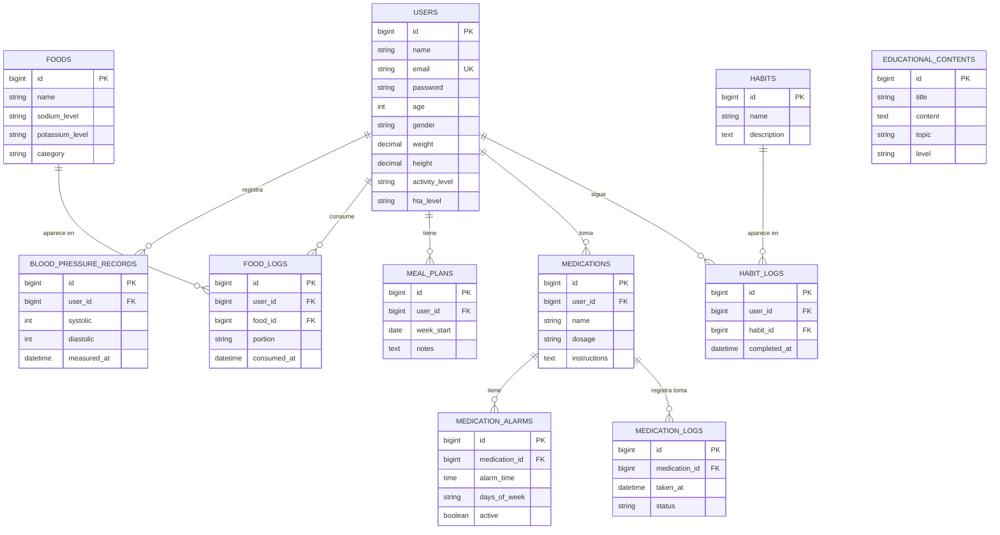

# Resumen del Modelo ER – App de Nutrición para Hipertensión

> **Arquitectura:** Flutter + Laravel + MySQL (cPanel)  
> **Autenticación:** JWT (tymon/jwt-auth)  
> **Fecha de implementación:** 7 de febrero de 2026

---

## 1. Visión General

El sistema se compone de **5 núcleos funcionales**:

1. **Usuarios** – Registro, autenticación y perfil clínico básico.
2. **Presión arterial** – Historial de mediciones de PA.
3. **Alimentación** – Catálogo de alimentos + registro de consumo + planes semanales.
4. **Medicamentos y alarmas** – Registro libre de fármacos, horarios y adherencia.
5. **Educación y hábitos** – Contenido educativo y seguimiento de hábitos saludables.

**Principios de diseño:**
- Normalización (3FN)
- Escalable
- Compatible con Eloquent ORM
- Sin dependencias clínicas reguladas

---

## 2. Entidades y Atributos

### 2.1 `users`
| Campo | Tipo | Notas |
|-------|------|-------|
| id | BIGINT (PK) | Auto-incremental |
| name | VARCHAR | |
| email | VARCHAR | UNIQUE |
| password | VARCHAR | Hashed |
| age | INT | Nullable |
| gender | VARCHAR(10) | masculino / femenino / otro |
| weight | DECIMAL(5,2) | Kg, nullable |
| height | DECIMAL(5,2) | Metros, nullable |
| activity_level | VARCHAR | sedentario / leve / moderado / activo / muy_activo |
| hta_level | VARCHAR | leve / moderada / severa |
| email_verified_at | TIMESTAMP | Nullable |
| remember_token | VARCHAR | |
| created_at | TIMESTAMP | |
| updated_at | TIMESTAMP | |

### 2.2 `blood_pressure_records`
| Campo | Tipo | Notas |
|-------|------|-------|
| id | BIGINT (PK) | |
| user_id | BIGINT (FK) | → users.id, CASCADE |
| systolic | INT | mmHg |
| diastolic | INT | mmHg |
| measured_at | DATETIME | |
| created_at | TIMESTAMP | |
| updated_at | TIMESTAMP | |

### 2.3 `foods`
| Campo | Tipo | Notas |
|-------|------|-------|
| id | BIGINT (PK) | |
| name | VARCHAR | |
| sodium_level | VARCHAR | bajo / medio / alto |
| potassium_level | VARCHAR | bajo / medio / alto |
| category | VARCHAR | frutas, verduras, proteínas, etc. |
| created_at | TIMESTAMP | |
| updated_at | TIMESTAMP | |

### 2.4 `food_logs`
| Campo | Tipo | Notas |
|-------|------|-------|
| id | BIGINT (PK) | |
| user_id | BIGINT (FK) | → users.id, CASCADE |
| food_id | BIGINT (FK) | → foods.id, CASCADE |
| portion | VARCHAR | |
| consumed_at | DATETIME | |
| created_at | TIMESTAMP | |
| updated_at | TIMESTAMP | |

### 2.5 `meal_plans`
| Campo | Tipo | Notas |
|-------|------|-------|
| id | BIGINT (PK) | |
| user_id | BIGINT (FK) | → users.id, CASCADE |
| week_start | DATE | Inicio de semana |
| notes | TEXT | Nullable |
| created_at | TIMESTAMP | |
| updated_at | TIMESTAMP | |

### 2.6 `medications`
| Campo | Tipo | Notas |
|-------|------|-------|
| id | BIGINT (PK) | |
| user_id | BIGINT (FK) | → users.id, CASCADE |
| name | VARCHAR | |
| dosage | VARCHAR | |
| instructions | TEXT | Nullable |
| created_at | TIMESTAMP | |
| updated_at | TIMESTAMP | |

### 2.7 `medication_alarms`
| Campo | Tipo | Notas |
|-------|------|-------|
| id | BIGINT (PK) | |
| medication_id | BIGINT (FK) | → medications.id, CASCADE |
| alarm_time | TIME | |
| days_of_week | VARCHAR | ej: "lun,mar,mie,jue,vie" |
| active | BOOLEAN | Default: true |
| created_at | TIMESTAMP | |
| updated_at | TIMESTAMP | |

### 2.8 `medication_logs`
| Campo | Tipo | Notas |
|-------|------|-------|
| id | BIGINT (PK) | |
| medication_id | BIGINT (FK) | → medications.id, CASCADE |
| taken_at | DATETIME | |
| status | VARCHAR | tomado / omitido |
| created_at | TIMESTAMP | |
| updated_at | TIMESTAMP | |

### 2.9 `educational_contents`
| Campo | Tipo | Notas |
|-------|------|-------|
| id | BIGINT (PK) | |
| title | VARCHAR | |
| content | TEXT | |
| topic | VARCHAR | hipertensión, nutrición, hábitos, medicamentos |
| level | VARCHAR | básico / intermedio |
| created_at | TIMESTAMP | |
| updated_at | TIMESTAMP | |

### 2.10 `habits`
| Campo | Tipo | Notas |
|-------|------|-------|
| id | BIGINT (PK) | |
| name | VARCHAR | |
| description | TEXT | Nullable |
| created_at | TIMESTAMP | |
| updated_at | TIMESTAMP | |

### 2.11 `habit_logs`
| Campo | Tipo | Notas |
|-------|------|-------|
| id | BIGINT (PK) | |
| user_id | BIGINT (FK) | → users.id, CASCADE |
| habit_id | BIGINT (FK) | → habits.id, CASCADE |
| completed_at | DATETIME | |
| created_at | TIMESTAMP | |
| updated_at | TIMESTAMP | |

---

## 3. Relaciones (Cardinalidad)

```
USERS        1 ── N   BLOOD_PRESSURE_RECORDS
USERS        1 ── N   FOOD_LOGS
FOODS        1 ── N   FOOD_LOGS
USERS        1 ── N   MEAL_PLANS
USERS        1 ── N   MEDICATIONS
MEDICATIONS  1 ── N   MEDICATION_ALARMS
MEDICATIONS  1 ── N   MEDICATION_LOGS
USERS        1 ── N   HABIT_LOGS
HABITS       1 ── N   HABIT_LOGS
```

> Las alarmas se configuran desde el backend pero se ejecutan localmente en Flutter (`flutter_local_notifications`).

---

## 4. Diagrama ER (Mermaid)



---

## 5. Archivos Implementados

### Migraciones (`database/migrations/`)
| Archivo | Tabla |
|---------|-------|
| `2014_10_12_000000_create_users_table.php` | users (actualizada con campos clínicos) |
| `2025_01_01_000001_create_blood_pressure_records_table.php` | blood_pressure_records |
| `2025_01_01_000002_create_foods_table.php` | foods |
| `2025_01_01_000003_create_food_logs_table.php` | food_logs |
| `2025_01_01_000004_create_meal_plans_table.php` | meal_plans |
| `2025_01_01_000005_create_medications_table.php` | medications |
| `2025_01_01_000006_create_medication_alarms_table.php` | medication_alarms |
| `2025_01_01_000007_create_medication_logs_table.php` | medication_logs |
| `2025_01_01_000008_create_educational_contents_table.php` | educational_contents |
| `2025_01_01_000009_create_habits_table.php` | habits |
| `2025_01_01_000010_create_habit_logs_table.php` | habit_logs |

### Modelos Eloquent (`app/Models/`)
| Modelo | Relaciones |
|--------|------------|
| `User` | hasMany: BloodPressureRecord, FoodLog, MealPlan, Medication, HabitLog. Implementa `JWTSubject`. |
| `BloodPressureRecord` | belongsTo: User |
| `Food` | hasMany: FoodLog |
| `FoodLog` | belongsTo: User, Food |
| `MealPlan` | belongsTo: User |
| `Medication` | belongsTo: User · hasMany: MedicationAlarm, MedicationLog |
| `MedicationAlarm` | belongsTo: Medication |
| `MedicationLog` | belongsTo: Medication |
| `EducationalContent` | — (catálogo independiente) |
| `Habit` | hasMany: HabitLog |
| `HabitLog` | belongsTo: User, Habit |

### Controladores (`app/Http/Controllers/`)
| Controlador | Acciones |
|-------------|----------|
| `AuthController` | register, login, logout, refresh, me, updateProfile |
| `BloodPressureRecordController` | index, store, show, destroy |
| `FoodController` | index, show, store (filtro por categoría y sodio) |
| `FoodLogController` | index, store, destroy |
| `MealPlanController` | index, store, show, update, destroy |
| `MedicationController` | index, store, show, update, destroy |
| `MedicationAlarmController` | store, update, destroy |
| `MedicationLogController` | index, store |
| `EducationalContentController` | index, show (filtro por topic y level) |
| `HabitController` | index, show |
| `HabitLogController` | index, store, destroy |

### Seeders (`database/seeders/`)
| Seeder | Datos |
|--------|-------|
| `FoodSeeder` | 23 alimentos clasificados por sodio/potasio |
| `HabitSeeder` | 10 hábitos saludables para hipertensos |
| `EducationalContentSeeder` | 8 artículos sobre hipertensión, nutrición y hábitos |

---

## 6. Endpoints API (42 rutas)

### Autenticación (público)
| Método | Ruta | Descripción |
|--------|------|-------------|
| POST | `/api/register` | Registro de usuario |
| POST | `/api/login` | Iniciar sesión (devuelve JWT) |

### Protegidos (requieren JWT en header `Authorization: Bearer {token}`)

#### Perfil
| Método | Ruta | Descripción |
|--------|------|-------------|
| GET | `/api/me` | Datos del usuario autenticado |
| POST | `/api/logout` | Cerrar sesión |
| POST | `/api/refresh` | Renovar token |
| PUT | `/api/profile` | Actualizar perfil (age, gender, weight, height, etc.) |

#### Presión Arterial
| Método | Ruta | Descripción |
|--------|------|-------------|
| GET | `/api/blood-pressure` | Listar registros |
| POST | `/api/blood-pressure` | Crear registro |
| GET | `/api/blood-pressure/{id}` | Ver detalle |
| DELETE | `/api/blood-pressure/{id}` | Eliminar |

#### Alimentos
| Método | Ruta | Descripción |
|--------|------|-------------|
| GET | `/api/foods` | Catálogo (filtro: `?category=`, `?sodium_level=`) |
| GET | `/api/foods/{id}` | Detalle |
| POST | `/api/foods` | Agregar alimento |

#### Registro de Consumo
| Método | Ruta | Descripción |
|--------|------|-------------|
| GET | `/api/food-logs` | Historial de consumo |
| POST | `/api/food-logs` | Registrar consumo |
| DELETE | `/api/food-logs/{id}` | Eliminar |

#### Planes Alimenticios
| Método | Ruta | Descripción |
|--------|------|-------------|
| GET | `/api/meal-plans` | Listar planes |
| POST | `/api/meal-plans` | Crear plan |
| GET | `/api/meal-plans/{id}` | Ver detalle |
| PUT | `/api/meal-plans/{id}` | Actualizar |
| DELETE | `/api/meal-plans/{id}` | Eliminar |

#### Medicamentos
| Método | Ruta | Descripción |
|--------|------|-------------|
| GET | `/api/medications` | Listar (incluye alarmas) |
| POST | `/api/medications` | Crear |
| GET | `/api/medications/{id}` | Ver detalle (alarmas + logs) |
| PUT | `/api/medications/{id}` | Actualizar |
| DELETE | `/api/medications/{id}` | Eliminar |

#### Alarmas de Medicamentos
| Método | Ruta | Descripción |
|--------|------|-------------|
| POST | `/api/medications/{id}/alarms` | Crear alarma |
| PUT | `/api/medication-alarms/{id}` | Actualizar |
| DELETE | `/api/medication-alarms/{id}` | Eliminar |

#### Registro de Toma
| Método | Ruta | Descripción |
|--------|------|-------------|
| GET | `/api/medications/{id}/logs` | Historial de tomas |
| POST | `/api/medications/{id}/logs` | Registrar toma (tomado/omitido) |

#### Contenido Educativo
| Método | Ruta | Descripción |
|--------|------|-------------|
| GET | `/api/educational-contents` | Listar (filtro: `?topic=`, `?level=`) |
| GET | `/api/educational-contents/{id}` | Ver detalle |

#### Hábitos
| Método | Ruta | Descripción |
|--------|------|-------------|
| GET | `/api/habits` | Catálogo de hábitos |
| GET | `/api/habits/{id}` | Detalle |
| GET | `/api/habit-logs` | Seguimiento del usuario |
| POST | `/api/habit-logs` | Registrar cumplimiento |
| DELETE | `/api/habit-logs/{id}` | Eliminar |

---

## 7. Configuración

### Auth (`config/auth.php`)
- **Guard por defecto:** `api` (driver: `jwt`)
- **Provider:** `eloquent` → `App\Models\User`

### JWT (`config/jwt.php`)
- Paquete: `tymon/jwt-auth`
- El modelo `User` implementa `JWTSubject`

### Comando para inicializar la BD
```bash
php artisan migrate --seed
```

---

## 8. Compatibilidad Técnica

| Componente | Tecnología |
|------------|------------|
| **Frontend** | Flutter (`flutter_local_notifications` para alarmas) |
| **Backend** | Laravel 10 + Eloquent ORM + JWT |
| **Base de datos** | MySQL (compatible con cPanel compartido) |
| **API** | REST, JSON, protegida con JWT |
| **Sync** | REST API estándar |

---

## 9. Mapeo de Requisitos Funcionales (SRS)

| Requisito | Descripción | Endpoint(s) | Controlador |
|-----------|-------------|-------------|-------------|
| **RF-01** | Onboarding: PA inicial, restricciones alimentarias | `POST /api/onboarding` | `AuthController@onboarding` |
| **RF-02** | Monitoreo visual de PA (estadísticas diarias/semanales/mensuales) | `GET /api/blood-pressure-stats?period=weekly` | `BloodPressureRecordController@statistics` |
| **RF-03** | Semáforo de clasificación de PA (verde / amarillo / rojo) | Incluido en `store`, `show`, `statistics` | `BloodPressureRecordController` |
| **RF-04** | Planes alimenticios personalizados | `CRUD /api/meal-plans` | `MealPlanController` |
| **RF-05** | Recomendaciones nutricionales dinámicas DASH | `GET /api/nutritional-recommendations` | `NutritionalRecommendationController` |
| **RF-06** | Registro de alimentos consumidos | `CRUD /api/food-logs`, `GET /api/foods` | `FoodLogController`, `FoodController` |
| **RF-07** | Contenido educativo progresivo | `GET /api/educational-contents` | `EducationalContentController` |
| **RF-08** | Seguimiento de hábitos con rachas y refuerzo positivo | `GET /api/habit-streaks`, `GET /api/habit-streaks/{habit}` | `HabitStreakController` |
| **RF-09.1** | Registro de medicamentos | `CRUD /api/medications` | `MedicationController` |
| **RF-09.2** | Alarmas (notificación local Flutter) | `POST /api/medications/{id}/alarms` | `MedicationAlarmController` |
| **RF-09.3** | Registro de toma | `POST /api/medications/{id}/logs` | `MedicationLogController` |
| **RF-09.4** | Estadísticas de adherencia | `GET /api/medication-adherence?period=monthly` | `MedicationAdherenceController` |
| **RF-10** | Dashboard consolidado + historial filtrable | `GET /api/dashboard`, `GET /api/history` | `DashboardController` |

### Requisitos No Funcionales

| Requisito | Implementación |
|-----------|---------------|
| **RNF-01** | Diseño responsive delegado al frontend Flutter |
| **RNF-02** | JWT con refresh token, contraseñas hash bcrypt |
| **RNF-03** | MySQL compatible con cPanel compartido |
| **RNF-04** | REST JSON + caché de Eloquent |
| **RNF-05** | `GET /api/disclaimer` – Aviso legal público |

### Nuevas Migraciones (SRS)

| Migración | Campos agregados |
|-----------|-----------------|
| `_000011_add_onboarding_fields_to_users_table` | `initial_systolic`, `initial_diastolic`, `food_restrictions`, `onboarding_completed` |
| `_000012_add_order_to_educational_contents_table` | `order`, `is_premium` |

### Nuevos Controladores (SRS)

| Controlador | Responsabilidad |
|-------------|----------------|
| `NutritionalRecommendationController` | Recomendaciones DASH dinámicas según última PA |
| `HabitStreakController` | Cálculo de rachas y mensajes de refuerzo positivo |
| `MedicationAdherenceController` | Estadísticas de adherencia con alertas informativas |
| `DashboardController` | Vista consolidada + historial unificado |

### Total de Rutas API

**51 rutas** registradas (`php artisan route:list`), incluyendo: 3 públicas (register, login, disclaimer) y 48 protegidas con JWT.
